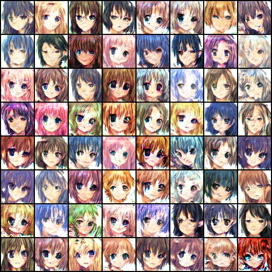

# StyleGAN implementation for the Anime Face Dataset
[StyleGAN](https://arxiv.org/abs/1812.04948v3) that produces anime faces.
This is an implementation I made as a learning project, there may be some mistakes
as this is my first GAN!



The dataset has been taken from [kaggle](https://www.kaggle.com/splcher/animefacedataset).
Thanks to *splcher* for providing this funny dataset.

Link to the WandB project can be found [here](https://wandb.ai/pierrotlc/AnimeStyleGAN).

## Installation
After cloning the repo, you will have do download the dataset.
It can be found [here](https://www.kaggle.com/splcher/animefacedataset).

Then you can run the initialization script:
```sh
cd path/to/repo/AnimeStyleGAN
python3 prepare.py [path_to_dataset.zip]
```

This script will extract the images and put them in the right directory.

## Train the model
To train the model: `python3 launch_training.py`

The configuration is stored in the `scr/train.py`.
The best configuration found is the following:
```py
config = {
    # Global params
    'dim_image': 64,
    'batch_size': 256,
    'epochs': 50,
    'dropout': 0.3,
    'device': 'cuda' if torch.cuda.is_available() else 'cpu',
    'seed': 0,
    'n_iter_log': 10,

    # StyleGAN params
    'n_channels': 512,
    'dim_z': 196,
    'n_layers_z': 4,
    'n_layers_block': 3,
    'n_noise': 10,
    'lr_g': 1e-4,
    'betas_g': (0.5, 0.5),
    'weight_decay_g': 0,
    'milestones_g': [15],
    'gamma_g': 0.1,
    'running_avg_factor_G': 0.9,
    'weight_avg_factor_g': 0.5,
    'n_iter_g': 1,

    # Discriminator params
    'n_first_channels': 12,
    'n_layers_d_block': 5,
    'lr_d': 1e-4,
    'betas_d': (0.5, 0.99),
    'weight_decay_d': 0,
    'milestones_d': [15],
    'gamma_d': 0.1,
    'weight_fake_loss': 1,
    'running_avg_factor_D': 0.9,
    'weight_avg_factor_d': 0.5,
}
```

It is a pretty big model though (15M parameters for both the generator and the discriminator).


### Training regularization tricks
To make the training easier, there are many tricks:
* Style mixing (from the StyleGAN paper)
* Label smoothing
* Historical averaging
* Minibatch discrimination
* Spectral norm
* Noisy input to the discriminator

Many of those tricks can be found in this paper: [Improved Techniques for Training GANs, *Salimans et al*](https://arxiv.org/abs/1606.03498v1).

I tried the GP-WGAN but it did not perform very well.
Another improvement would be to do experience replay for the discriminator.

## Sources
* StyleGAN paper: [https://arxiv.org/abs/1812.04948v3](https://arxiv.org/abs/1812.04948v3)
* Improved techniques paper: [https://arxiv.org/abs/1606.03498v1](https://arxiv.org/abs/1606.03498v1)
* Dataset: [https://www.kaggle.com/splcher/animefacedataset](https://www.kaggle.com/splcher/animefacedataset)
